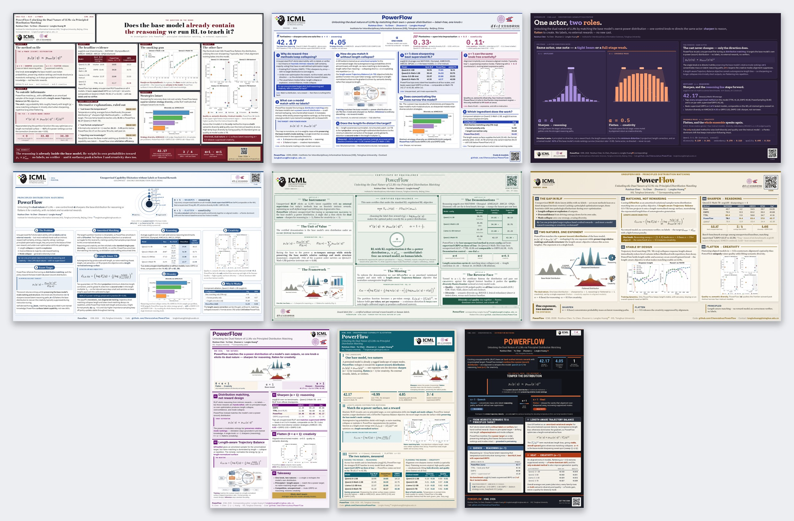
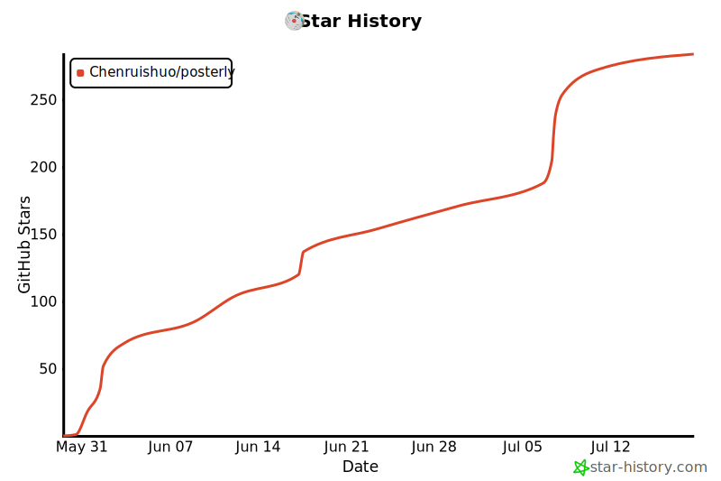

<h1 align="center">
  <picture>
    <source media="(prefers-color-scheme: dark)" srcset="docs/posterly-logo-dark.png">
    
  </picture>
</h1>

<p align="center"><b>Build academic conference posters as a single HTML/CSS file,<br>rendered to print-ready PDF via headless Chromium.</b></p>

<p align="center">
  <a href="LICENSE"></a>
  
  
</p>

<p align="center">
  <a href="https://tryposterly.com"></a>
  &nbsp;
  <a href="https://tryposterly.com/blog"></a>
</p>

<p align="center">English · <a href="README.zh-CN.md">简体中文</a></p>

p⊕sterly turns a paper into a print-ready conference poster at the exact canvas size you set — ICML, NeurIPS, ICLR, CVPR, or custom. Command-line checks catch overflow, misalignment, and off-palette styling before you print.

**Two ways to use it:**

- **Open-source skill (this repo).** Clone it and drive it from a coding agent — Claude Code, Codex, or any agent that supports skills. Runs on your machine; needs no posterly account.
- **Hosted app.** [**tryposterly.com**](https://tryposterly.com) runs it for you — currently in **private beta**, payments not yet enabled.

The [blog](https://tryposterly.com/blog) walks through how posterly turns a paper into a checked, print-ready poster.

---

## News

- 🚀 **[tryposterly.com](https://tryposterly.com) is live** — website, [blog](https://tryposterly.com/blog), and the hosted cloud app, now in private beta (payments not yet enabled).
- 🎨 **A *dramatically* wider design range** — posterly now composes many more distinct design directions per paper. See the [blog](https://tryposterly.com/blog) and [`templates/DESIGN-AXES.md`](templates/DESIGN-AXES.md).
- ⭐ **~50 posters at ICML 2026** were made with posterly.

---

## Showcase

**Nine examples, not nine templates.** posterly composes each direction from choices in layout, typography, palette, framing, density, and masthead — these nine are a sample of the combinations available. Below is one paper ([*PowerFlow*](https://arxiv.org/abs/2603.18363), ICML 2026) run through it nine times: the paper and content are held fixed, so only the design varies. Every one passes posterly's hard checks.

<p align="center">
  
</p>

Open any as a print-ready PDF — left to right, top to bottom:

<p align="center">
  <b>Landscape · 60×36</b> —
  <a href="docs/showcase/directions/evidence-board.pdf">Evidence board</a> ·
  <a href="docs/showcase/directions/musical-score.pdf">Musical score</a> ·
  <a href="docs/showcase/directions/theatre.pdf">Theatre</a> ·
  <a href="docs/showcase/directions/orrery.pdf">Orrery</a> ·
  <a href="docs/showcase/directions/certificate.pdf">Certificate</a> ·
  <a href="docs/showcase/directions/escort-broadside.pdf">Escort broadside</a><br>
  <b>Portrait · 24×36</b> —
  <a href="docs/showcase/directions/control-panel.pdf">Control panel</a> ·
  <a href="docs/showcase/directions/cartographic.pdf">Cartographic survey</a> ·
  <a href="docs/showcase/directions/heat-treatment.pdf">Heat treatment</a>
</p>

---

## Why HTML + CSS, not LaTeX?

- **Fast preview.** Edit CSS and refresh — no recompile step.
- **Modern layout.** Flexbox, grid, gradients, `text-wrap: balance`, and web fonts are available directly, without stacking LaTeX poster packages.
- **Checkable in code.** "Is this column overflowing?" becomes a Playwright geometry query instead of a visual guess.
- **Exact print size.** `@page { size: 60in 36in }` with Chromium's `page.pdf()` produces a PDF whose dimensions match the canvas.

Math is typeset with MathJax rather than natively by the browser: templates use the CDN when opened directly, and the gate/preview renders serve a bundled copy, so measurement works offline. [`SKILL.md`](SKILL.md) has the details.

---

## Install

**Install with an agent.** Paste to your coding agent:

> Install this skill for me: https://github.com/Chenruishuo/posterly

It clones the repo, installs the Python dependencies, and runs the smoke test. The manual steps:

```bash
# 1. Clone where your agent discovers skills — e.g. ~/.claude/skills/ for Claude Code
#    (other agents: use their skills directory)
git clone https://github.com/Chenruishuo/posterly ~/.claude/skills/posterly
cd ~/.claude/skills/posterly

# 2. Python deps
python -m pip install "playwright>=1.40"
python -m playwright install chromium
# On a fresh Linux box you may also need the system libs Chromium links against:
#   python -m playwright install --with-deps chromium
#   # or sudo apt install libnss3 libatk1.0-0 libatk-bridge2.0-0 libcups2 \
#   #                     libdrm2 libxkbcommon0 libxcomposite1 libxdamage1 \
#   #                     libxrandr2 libgbm1 libpango-1.0-0 libcairo2 libasound2

# 3. System dep for verify-final's pdfinfo
#    Linux:   apt install poppler-utils
#    macOS:   brew install poppler
#    Windows: choco install poppler

# 4. Smoke test
cd examples/hello_world
python ../../tools/poster_check.py preflight  poster.html
python ../../tools/poster_check.py measure    poster.html
python ../../tools/poster_check.py polish     poster.html
python ../../tools/render_preview.py          poster.html
python ../../tools/poster_check.py verify-final poster_preview.pdf --from-html poster.html

# 5. (dev) run the test suite
python -m pip install "pytest>=7" && python -m pytest
```

The `poster_check.py` calls should print `PASS`, and `render_preview.py` should write `poster_preview.pdf` + `poster_preview.png`. posterly is clone-only (no PyPI); `pyproject.toml` holds the dependencies and pytest config.

---

## Use the skill

Point your agent at the paper's source directory:

> Use the posterly skill to make my ICML 2026 poster from the LaTeX project at ~/papers/mypaper/. Logos are in ~/papers/mypaper/logos/, and the QR code should link to https://github.com/you/yourcode

In Claude Code, `/posterly` is the shortcut for that.

The LaTeX source is the only required input; the agent reads it directly and is instructed to ground every number and claim in the paper. Venue, logos, a QR target, brand colors, style preferences, and text density are optional — the agent asks for any it needs before drafting.

You don't choose a look from a list. posterly renders two or three different design directions as thumbnails, you pick one by eye, and it then fills, checks, and exports that poster. Read the workflow overview on the [blog](https://tryposterly.com/blog); the full design reference is in [`templates/DESIGN-AXES.md`](templates/DESIGN-AXES.md).

Direct PDF input (instead of LaTeX) is untested so far.

---

## What's in here

```
posterly/
├── SKILL.md              ← the workflow your agent follows for /posterly
├── tools/
│   ├── run_gates.py      ← runs the check gates into one report
│   ├── poster_check.py   ← preflight / measure / pack / fit-logos / polish / verify-final
│   ├── render_preview.py ← print-emulated PDF + thumbnail PNG
│   ├── style_check.py    ← design-token gate
│   ├── asset_check.py    ← real-figure provenance (opt-in)
│   ├── extract_pdf_figures.py, preprocess_figures.py
│   └── _posterly/        ← internal modules
├── templates/            ← landscape_4col, landscape_hero, portrait_2col
├── specimens/axes/       ← rendered catalog of the design options
├── examples/hello_world/ ← minimal poster the install smoke test and tests run against
├── docs/showcase/        ← the showcase montage + a PDF per direction
└── tests/                ← pytest suite
```

The checks, briefly:

- **`run_gates.py`** runs `preflight → style → asset → measure → polish` into one report (`asset` is reported `NOT_RUN` without a `--manifest`). It's the default loop while drafting.
- **`poster_check.py`** exposes the checks individually — `preflight` (static lint), `measure` (print-emulated geometry), `pack` and `fit-logos` (advisory pre-checks), `polish` (soft visual checks), and `verify-final` (post-render PDF sanity, run separately on the exported PDF).

Each command supports `--help`; [`SKILL.md`](SKILL.md) has the thresholds and tuning flags, and [`templates/README.md`](templates/README.md) the template conventions.

---

## Editing by hand

For manual editing, copy the closest scaffold from [`templates/`](templates/) and change the shared values in its `:root` token block — the style gate expects colors and sizes to come from there, not from individual elements. A tokenized poster keeps its gate metadata in `design_tokens.json`.

- Template contracts — [`templates/README.md`](templates/README.md)
- Design options — [`templates/DESIGN-AXES.md`](templates/DESIGN-AXES.md)
- Palette and token reference — [`templates/THEMES.md`](templates/THEMES.md)
- Full agent workflow — [`SKILL.md`](SKILL.md)

(`examples/hello_world` is a minimal install/test fixture, not a general starting point.)

---

## License

posterly is licensed as a whole under the **GNU Affero General Public License
v3.0** (AGPL-3.0) © 2026 Ruishuo Chen — see [LICENSE](LICENSE). You may use,
modify, and commercialize it, **but any distributed or network-deployed (SaaS)
derivative must release its complete corresponding source under the same
license**. This is deliberate: it keeps posterly open and prevents closed-source
commercial exploitation.

This repository also vendors a few **MIT-licensed** gate tools from
[ARIS](https://github.com/wanshuiyin/Auto-claude-code-research-in-sleep); those
specific files remain available under their original MIT license. MIT is
GPL/AGPL-compatible, so the project as a whole is AGPL-3.0 while the vendored
files stay individually MIT. Details: [NOTICE.md](NOTICE.md) and
[LICENSES/](LICENSES/).

---

## Star History

<div align="center">

<!-- star-history:start -->
<picture>
  <source media="(prefers-color-scheme: dark)" srcset="docs/star-history/star-history-dark.svg">
  
</picture>
<!-- star-history:end -->

</div>
